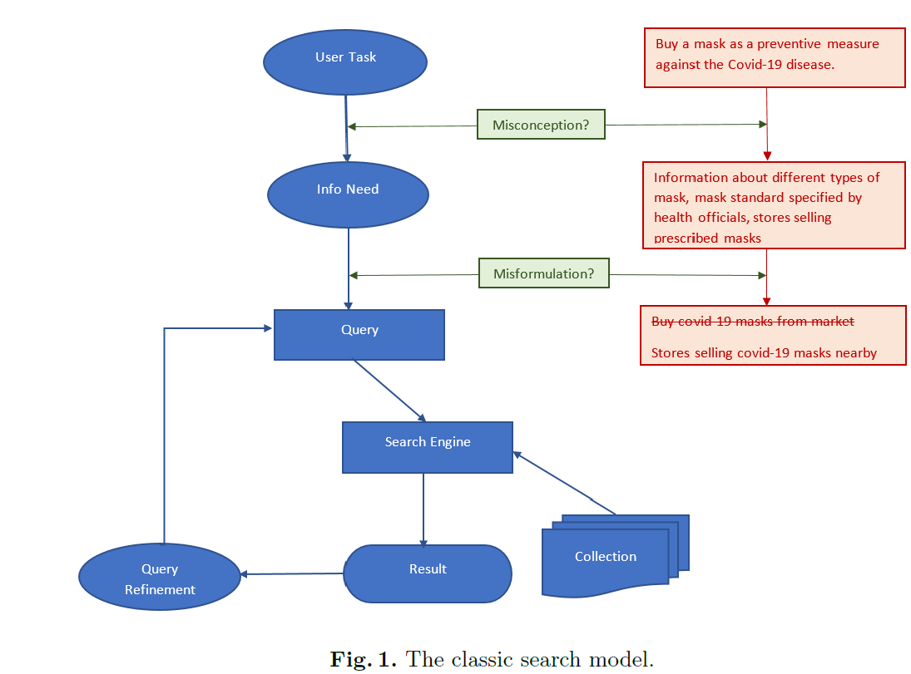
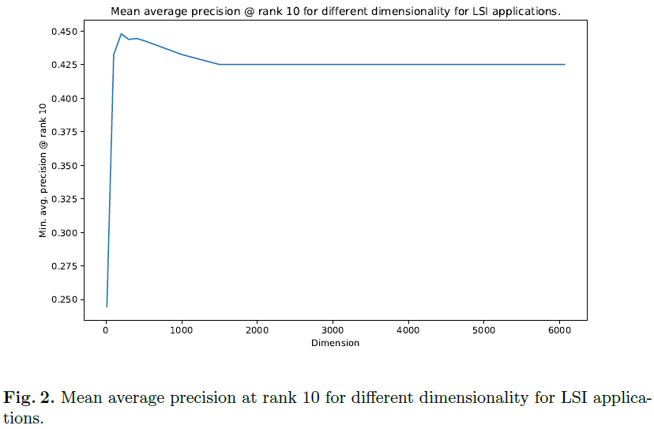
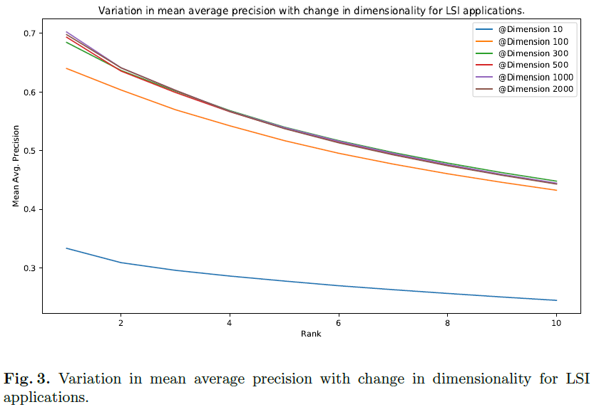
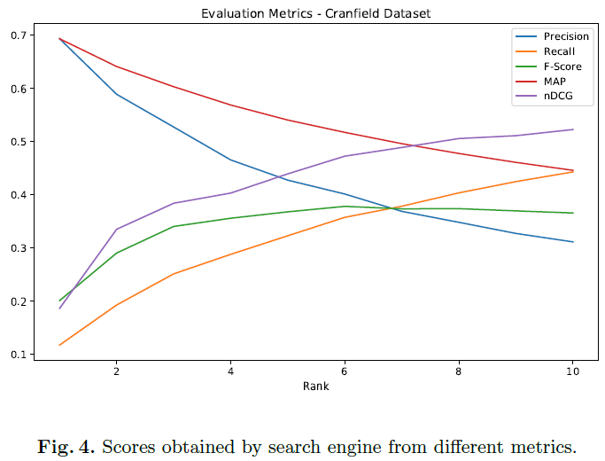

# Information-Retrieval-System
In this project, we build a simple search engine that retrieves appropriate documents corresponding to a given query by considering the semantic relatedness between the texts of the documents and the query. We study how to represent documents and queries as vectors in various representational spaces so that the documents most similar to any partcular query can be retrieved using an appropriate similarity measure. We also test the search engine's performance on a benchmark document collection and set of questions and present the results for the same.

## Some Basics of Informattion Retrieval
The goal of an IR system is to retrieve documents with information relevant to a user's information need and, consequently, help a user complete a task.

    

        
    
  

Assume that a user has a task they want to perform. For example, let us assume that a user wants to buy a mask as a preventive measure against the Covid-19 disease.
To achieve this task, the user needs various information like the
different types of masks available in the market, the standard of mask prescribed by the health officials, the stores currently selling the prescribed masks
etc. We refer to this as the Information Need of the user, and it is this information need that we use to assess an IR system. Hence, we type a query in the search box and let the IR system retrieve documents that are relevant to the query from the collections (i.e., a set of documents) and display them as the results. If the user is not satisfied with the results, then they may refine the query and again search documents concerning the new query to get desired results.

## Retrieving Documents Relevant to a Query
For an IR system to retrieve documents relevant to a particular query, we need a way to compare the collection of documents with the query and similarities. After that, based on the similarities, the system can rank the different documents on a scale of how similar the documents are to the particular query. Finally, the IR system returns some top k documents. 

### Comparing Documents with Queries
A straightforward way to compare documents with a query is to represent the documents and query as vectors in the same representational space and then use some appropriate similarity metric to find the similarities. Therefore, the rest the task is to create that common representational space. We can define such a representational space by different dimensions, where each dimension is a unique word in the vocabulary. We collect a set of documents that forms our corpus. All the different words in the corpus define the model's vocabulary, and we create a new representational space where each in the vocabulary represents a unique dimension.

## TF-IDF Model and LSI Model
In this project, we represent the queries and the documents using two specific models-
- The TF-IDF Model
- Latent Semantic Indexing (LSI) Model

### The TF-IDF Model
Here, we specifically represent the documents and the queries using the TF-IDF model, which is one of the most popular Vector Spce Models used for such tasks. I have discussed the process of creation of tf-idf vectors in the [SPAM-or-HAM] (https://github.com/debarghaBhattacharjee/SPAM-or-HAM) project.

### The LSI Model
The Tf-IDF has certain limitations which leads to the *term-mismatch* problem.SOme of these limitations:
- Ignoring the relationship between different words in vocabulary
- Ignoring words having same orthographic forms but different meanings

In order to overcome the problems associated with the different vector space models (such as the bag-of-words model and tf-idf model) and capture the word meanings and relatedness, we use the Latent Semantic Indexing (LSI) model ([Deerwester's et al., 1990] (http://lsa.colorado.edu/papers/JASIS.lsi.90.pdf)).

LSI transforms the document and query vectors from one space (*i.e.*, the word space) to another (*i.e.*, the concept space). It helps us to identify patterns and relationships between the different terms (i.e., words in the documents) and topics. Based on those patterns, LSI produces a set of concepts related to the documents and terms and finally expresses the documents and the queries in the concept space. We use Singular Value Decomposition (SVD) to create the concept space, which generally has a lower dimension than the word space.

## Results

### Mean Average Precision (MAP) at rank 10 for different dimensionality of the LSI model

    

        
    
  

### MAP vs. LSI model dimesnionality

    

        
    
  

### Scores obtained by search engine from different metrics

    

        
    
  

## Instructions
Please follow the steps given below-

1. Copy 'Cranfield' (which contains training documents and queries for this project) and 'source_code' to the same directory (if not already done).
2. **TRAINING-** Run the scripts in the following order-  
	(a) Execute- preprocess_docs_and_queries.py  
	(b) Execute- ranked_list_lsi_models_different_topics.py  
	(c) Execute- performance_comparison_lsi_models_different_topics.py  
	(d) Execute- vsm_models_performance_comparison.py  
3. **TESTING-** Let the query for which yu want to retrieve documents be "xyz".  
	(a) Execute- retrieve_docs_for_input_query.py -custom "xyz"  
	
**Created by-**  
	*Debargha Bhattacharjee*  
	*CS19S028, MS Scholar*  
	*Department of Computer Science and Engineering*  
	*IIT Madras*  
	*CS6370 Natural Language Processing Course Project*  
	
